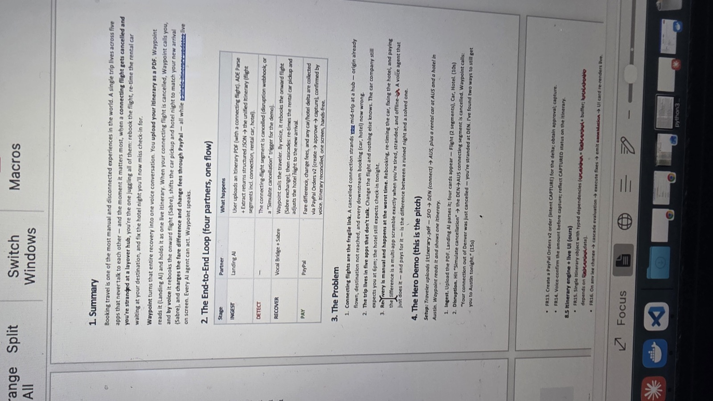
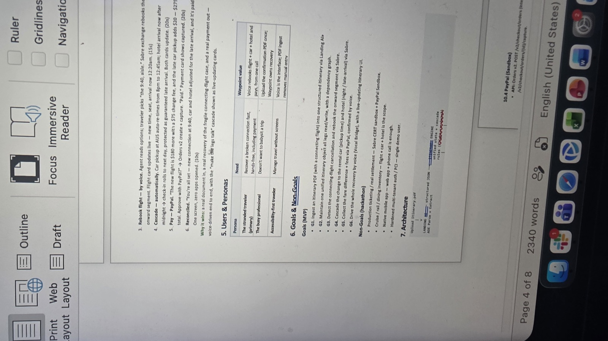
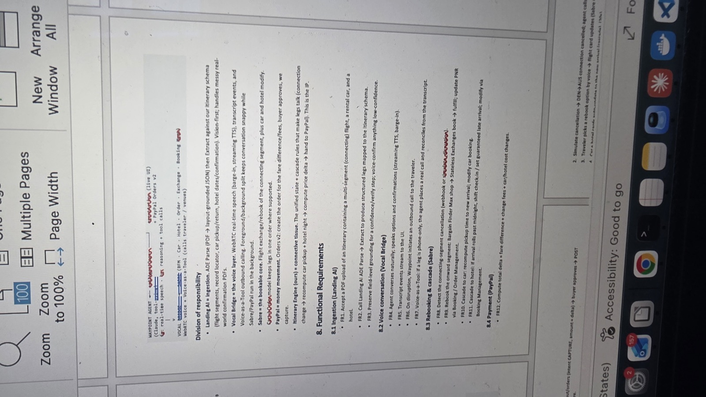

# WayPoint — Hackathon Submission

## Project name
**WayPoint**

## Tagline
When a connection breaks, recover the whole trip by voice — flight, car, hotel, and PayPal — on one live screen.

## Project description *(paste into Devpost / form)*

WayPoint is voice-led travel recovery for the fragile connecting-flight case.

Today, when DEN→AUS cancels, travelers open five apps that don’t talk — airline, car rental, hotel, payments, messaging — while stranded and stressed. WayPoint collapses that scramble into **one conversation**:

1. **Ingest** — Upload an itinerary PDF; **Landing AI** parses flights, car, and hotel into one structured itinerary.
2. **Detect** — A cancellation hits the connection (demo: Simulate cancellation).
3. **Recover** — **Vocal Bridge** calls the traveler; they pick a new flight by voice; **Sabre** rebooks; car pickup and hotel late-arrival **cascade** automatically on a live dependency graph.
4. **Pay** — **PayPal** Orders v2 creates the fare/fee delta; the traveler voice-confirms the amount; payment is captured and the trip is reconciled.

**Hero demo:** SFO → DEN → AUS + Hertz + Austin hotel. Simulate DEN→AUS cancelled. Agent says: *“Your connection out of Denver was just cancelled—I’ve found two ways to still get you to Austin tonight.”* Traveler picks by voice. Cards update live. PayPal captures. Whole trip recovered in under a minute — **one screen, zero apps opened**.

**Built with:** Next.js · Landing AI ADE · Vocal Bridge · Sabre · PayPal · itinerary cascade engine

---

## Elevator pitch (60 seconds)

Travel recovery is a multi-app scramble at the worst moment. WayPoint turns a cancelled connection into one voice call that rebooks the flight, shifts the car and hotel, and settles the price delta on PayPal — with live cards updating as each leg reconciles. Real document in. Real recovery. Real payment out. Voice-driven end to end.

---

## PRD source images

These are the product requirements pages used to build and describe WayPoint:

### 1. Problem & end-to-end loop

*Source: `29304.jpg`*

### 2. Users, goals & architecture

*Source: `29305.jpg`*

### 3. Partner responsibilities & functional requirements

*Source: `29306.jpg`*

---

## How it works (from PRD)

| Step | Partner | What happens |
| --- | --- | --- |
| Ingest | Landing AI | PDF → structured legs (flight, car, hotel) |
| Detect | Itinerary engine | Cancellation / disruption on a segment |
| Recover | Vocal Bridge + Sabre | Voice rebook; cascade car & hotel |
| Pay | PayPal | Voice-confirm delta → Orders v2 capture |

**Users:** stranded traveler · busy professional · accessibility-first traveler  
**Core IP:** dependency graph that makes the legs talk — change one flight, recompute the trip.

---

## Demo script

1. Open the app → **Load hero demo**
2. **Simulate cancellation** on DEN → AUS
3. **Start voice chat** (or **Call traveler** +1 209-998-1960)
4. Voice-pick a rebook option
5. Watch car/hotel cascade + PayPal capture on the live feed

---

## Tech stack

- **App:** Next.js App Router, React
- **Voice:** Vocal Bridge (`/api/voice-token`, outbound `/api/call`)
- **Document AI:** Landing AI ADE Parse + Extract
- **Travel:** Sabre (CERT / demo shop)
- **Payments:** PayPal Orders v2 (sandbox)
- **Engine:** Unified itinerary + cascade rules

---

## Why judges should care

> “A real document in, a real recovery of the fragile connecting-flight case, and a real payment out — voice-driven end to end, with the ‘make the legs talk’ cascade shown as live-updating cards.”

Not a chatbot demo — a full recovery loop: **document → voice → inventory → money**, on one screen.
